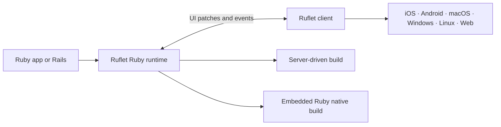

<p align="center">
  
</p>

<h1 align="center">Ruflet</h1>

<p align="center">
  <strong>Build web, desktop, and mobile applications in Ruby.</strong>
</p>

<p align="center">
  <a href="https://rubygems.org/gems/ruflet"></a>
  
  <a href="https://github.com/AdamMusa/ruflet/actions/workflows/build-ruflet-client.yml"></a>
  <a href="LICENSE"></a>
</p>

Ruflet is a Ruby framework for building mobile, desktop, and web applications
from one codebase. Flutter does the rendering, so what ships is a real native
app on Android, iOS, macOS, Windows, Linux, and the web.

You write Ruby. There is no Dart, Kotlin, Swift, or JavaScript in your app.

The same code runs two ways: **server-driven**, where a Ruby process drives the
client and your edits reload in place, or **self-contained**, where Ruby and your
app are packaged into the native binary and ship as one.

[Ruflet Explorer](https://github.com/AdamMusa/ruflet_explorer) is the preview
client — install it once and every Ruby app you write appears on the device, with
no rebuild in between. It is itself written in Ruflet.

> [!NOTE]
> Ruflet is under active pre-1.0 development. APIs can evolve as the framework
> moves toward a stable release.

## Why Ruflet?

- **One Ruby UI for every screen.** Use the same controls, callbacks, and state
  model across mobile, desktop, and web.
- **Flutter-rendered interfaces.** Build Material and Cupertino experiences
  with responsive layouts, navigation, dialogs, data tables, charts, maps,
  media, animations, canvas drawing, and more.
- **A fast development loop.** Ruby files reload without restarting the client.
  Broken edits keep the last working interface visible while Ruflet reports the
  error in the terminal.
- **Server-driven or self-contained.** Keep application logic on a Ruby server,
  or embed the Ruby runtime and app into a native package with `--self`.
- **Real device capabilities.** Work with camera, location, motion, storage,
  sharing, haptics, sensors, and protected native permissions through Ruby APIs.
- **Targeted live updates.** Update mounted controls without rebuilding the
  entire page, while events travel back to ordinary Ruby callbacks.
- **Rails-aware.** Mount Ruflet inside Rails, work with the same models and
  application code, or place existing Rails pages inside a managed native
  WebView shell.
- **Extensible.** Add typed Ruby controls backed by standard Flutter extension
  packages. Ruflet's QR and barcode scanner is built with the same extension
  model.

## A Ruflet app

This counter is a complete Ruflet application:

```ruby
require "ruflet"

Ruflet.run do |page|
  page.title = "Ruflet Counter"

  count = 0
  counter = text("0", style: { size: 48, weight: "w700" })

  page.add(
    container(
      expand: true,
      padding: 24,
      alignment: "center",
      content: column(
        spacing: 16,
        horizontal_alignment: "center",
        children: [
          text("Count every tap", style: { size: 22, weight: "w600" }),
          counter,
          button(
            content: "Add one",
            on_click: ->(_event) do
              count += 1
              page.update(counter, value: count.to_s)
            end
          )
        ]
      )
    )
  )
end
```

Controls build the interface tree, callbacks run in Ruby, and `page.update`
patches the mounted control on every connected client.

## Quick start

Install Ruflet, create a project, and start it:

```bash
gem install ruflet
ruflet new my_app
cd my_app
bundle install
ruflet run
```

`ruflet run` starts the Ruby backend and prints a QR code for the mobile client.
Run Ruflet commands directly—there is no need to prefix them with `bundle exec`.

Open the same application in a browser or native desktop client:

```bash
ruflet run --web
ruflet run --desktop
```

On macOS, launch the prebuilt native Apple renderer in the already-booted iOS
Simulator with either experimental spelling:

```bash
ruflet run --experimental
ruflet run --exp
```

The first run downloads the experimental Ruflet Explorer simulator build from
the selected client release channel. Later runs reuse the versioned local
cache, install it on the currently booted simulator, and pass the Ruby
backend URL at launch.

To run the same experimental renderer as a native macOS desktop app, use:

```bash
ruflet run --desktop --exp
```

Its macOS prebuild is downloaded into a separate cache from the standard
Flutter desktop client and receives the local Ruby backend URL at launch.

### Development targets

| Target | Command | What happens |
| --- | --- | --- |
| Mobile | `ruflet run` | Starts the backend and prints a connection QR code. |
| Experimental iOS | `ruflet run --experimental` | Downloads/reuses and launches the native Apple Explorer in the booted simulator. |
| Web | `ruflet run --web` | Starts the backend and opens the Ruflet web client. |
| Desktop | `ruflet run --desktop` | Starts the backend and launches the host desktop client. |
| Experimental macOS | `ruflet run --desktop --exp` | Downloads/reuses and launches the native Apple desktop Explorer. |

Hot reload is enabled by default. Press `r` for a manual Ruby UI reload or `R`
for a complete backend restart. The current route survives a reload; in-memory
application state starts fresh. Use `--no-reload` when file watching is not
wanted.

## Two ways to ship

| Mode | Best for | How it works |
| --- | --- | --- |
| **Server-driven** | Connected applications, shared business logic, Rails, and centrally deployed updates | The Ruflet client connects to a Ruby backend and receives UI patches over its live connection. |
| **Self-contained** | Native distribution and local or offline Ruby execution | Ruflet packages the Ruby runtime, application files, and the Ruflet client together with `ruflet build <target> --self`. |

Both modes use the same Ruby controls and event handlers.

## Advanced by design

### Rich controls without frontend glue

Ruflet exposes Ruby builders for layout, navigation, inputs, dialogs, menus,
responsive views, drag and drop, canvas shapes, maps, charts, media, Lottie,
Rive, Markdown, SpinKit loaders, and adaptive Material/Cupertino controls.

Use the Ruby DSL directly:

```ruby
dashboard = column(
  spacing: 12,
  children: [
    text("Dashboard", style: { size: 28, weight: "w700" }),
    responsive_row(
      children: [
        card(content: text("Revenue"), col: { xs: 12, md: 6 }),
        card(content: text("Orders"), col: { xs: 12, md: 6 })
      ]
    ),
    lottie("assets/success.json", repeat: true)
  ]
)
```

### Navigation, overlays, and application services

The `page` object owns application-level behavior: routes and views, dialogs,
bottom sheets, snackbars, menus, windows, clipboard, file picking, sharing,
URLs, storage paths, screenshots, camera access, haptics, and other services.

```ruby
page.go("/settings", tab: "profile")
page.launch_url("https://example.com")

saved = alert_dialog(
  open: false,
  modal: true,
  title: text("Saved"),
  content: text("Your changes are stored."),
  actions: [
    text_button(
      content: text("OK"),
      on_click: ->(_event) { page.close_dialog(saved) }
    )
  ]
)

page.show_dialog(saved)
```

A dialog is an ordinary control: build it once, keep the reference, and let
`page` mount and dismiss it.

### Extensions that stay typed in Ruby

Independent extensions are selected in `ruflet.yaml`, then Ruflet includes the
matching Flutter packages and registrations in the generated client. Maps,
charts, code editing, Lottie, Rive, video, WebView, and QR scanning are examples
of extension-backed controls.

```yaml
extensions:
  - charts
  - lottie
  - map
  - qrcode_scanner
  - webview
```

The QR scanner is a first-party example: `ruflet_qrcode_scanner` is a normal
extension package backed by `mobile_scanner`, while application code uses the
Ruby `qrcode_scanner(...)` builder.

An extension that Ruflet does not bundle names where to fetch it from:

```yaml
extensions:
  - charts
  - my_package:
      git:
        url: https://github.com/owner/my_package
        ref: main
```

Ruflet adds it to the generated client's dependencies and registers it, taking
the import and the `Extension()` call from the package name, which every
extension package follows. `branch` and `tag` work in place of `ref`, and `path`
takes a local checkout instead of a repository.

At build time the managed Flutter client keeps the core `flet` package plus
only the local packages selected by `extensions:` and `services:`. Packages
removed for one build are restored automatically from the client template if a
later configuration declares them again.

### Protected capabilities are explicit

Camera, microphone, location, and motion access are declared in
`services.yaml`. Ruflet activates the required client integrations and writes
the matching Android and iOS permission descriptions during the build. Ruflet
also removes its previously managed permissions when the capability is no
longer declared, so stale camera, microphone, location, or motion access does
not ship in the next build.

```yaml
services:
  - camera:
      description: Scan QR codes and capture photos.
  - location:
      description: Show nearby places.
```

## Project configuration

`ruflet.yaml` describes the application — who it is, where it connects, and how
it is built. `services.yaml` is reserved for capabilities the operating system
guards behind a permission prompt:

| File | Purpose |
| --- | --- |
| `main.rb` | Ruby application entry point. |
| `ruflet.yaml` | Application identity, backend URL, UI extensions, assets, and build presentation. |
| `services.yaml` | Protected native capabilities. |
| `Gemfile` | Ruby runtime dependencies. |

### Application identity

Identity is the `app` block in `ruflet.yaml`:

```yaml
app:
  name: My Ruflet App
  package_name: my_ruflet_app
  organization: com.example
  version: 1.0.0+1
  description: A cross-platform Ruflet application.
```

`name` is the label under the icon on the device, `package_name` is the
technical identifier, and `organization` is the reverse-domain prefix that owns
it. For Android and iOS, Ruflet joins the last two into
`com.example.my_ruflet_app` and applies it through `change_app_package_name`
during the build pipeline. Every other target reads the same block: bundle
identifiers on macOS, the application ID on Linux, the binary name and version
resources on Windows, and the document title on the web.

A mobile build stops with a configuration error when `name`, `package_name`, or
`organization` is missing; the Flutter template identifier is never shipped as
the application's identifier.

A store listing that needs an identifier other than the derived one names it
directly:

```yaml
app:
  android_application_id: com.example.myapp.android
  ios_bundle_identifier: com.example.myapp
```

Projects created before identity moved into `ruflet.yaml` may still carry an
`app` block in `services.yaml`. Ruflet keeps reading it, but only to fill in
keys `ruflet.yaml` leaves out — what the project states wins. `app_name` and
`display_name` remain accepted spellings of `name`.

### Runtime and assets

The same `app` block carries the backend URL, alongside the extension, asset,
and build sections:

```yaml
app:
  backend_url: https://api.example.com

extensions:
  - charts
  - map

assets:
  dir: assets
  splash_screen: assets/splash.png
  splash_color: "#FFFFFF"
  splash_dark_color: "#0B0B0B"
  icon_launcher: assets/icon.png
  icon_background: "#FFFFFF"
  theme_color: "#6750A4"
```

`assets` holds the images and the colours that style them. Every key is also
accepted under `build`, which older projects use, and under a platform section
that overrides it — see [Per-platform icon and splash](#per-platform-icon-and-splash).

`backend_url` is required for server-driven production builds, and ignored when
building with `--self`. Clients that are told which server to use at launch may
omit it: a web client resolves the origin it is served from, and a desktop
client takes the URL its launcher passes. Baking one in would pin them to a
single host and port.

### Per-platform icon and splash

Every platform has its own section using the same key names — `splash_screen`,
`splash_dark`, `splash_color`, `splash_dark_color`, and `icon_launcher` — falling
back to the shared `assets` and `build` values when a key is not overridden. The
same keys are also accepted under `build.<platform>` and `assets.<platform>`.

```yaml
android:
  splash_color: "#FFFFFF"
  splash_dark_color: "#0B0B0B"
  splash_fullscreen: true
  splash_android_12_icon_background_color: "#FFFFFF"
  adaptive_icon_background: "#FFFFFF"
  adaptive_icon_foreground: assets/icon_foreground.png
  min_sdk: 21

ios:
  splash_screen: assets/splash_ios.png
  icon_launcher: assets/icon_ios.png
  remove_alpha: true
  content_mode: scaleAspectFit

web:
  icon_launcher: assets/icon_web.png
  icon_background: "#FFFFFF"
  theme_color: "#6750A4"

macos:
  icon_launcher: assets/icon_macos.png

windows:
  icon_launcher: assets/icon_windows.ico
  icon_size: 48
```

## Build and install

Check the local toolchain first. Ruflet can install and manage a compatible
Flutter SDK when needed:

```bash
ruflet doctor
ruflet doctor --fix
```

Build for a target platform:

```bash
ruflet build apk
ruflet build aab
ruflet build ios
ruflet build macos
ruflet build windows
ruflet build linux
ruflet build web
```

Add `--self` to package the Ruby runtime and application into a native build:

```bash
ruflet build apk --self
ruflet build ios --self
```

`ruflet build ios --self` prepares both the physical-device and simulator app
bundles. You do not need a separate simulator build command.

On iOS and macOS, add `--experimental` to replace only the renderer with the
native Apple engine. The ordinary build configuration still selects services,
extensions, permissions, identity, assets, and runtime mode:

```bash
ruflet build ios --experimental
ruflet build macos --self --exp
```

Without this flag, Apple builds contain the standard Flutter renderer and do
not link the experimental Swift renderer package.

The build resolves services and extensions before Flutter package resolution.
Standard builds keep only the declared Flutter extension packages. Experimental
Apple builds register those declarations with their Swift implementations and
remove the equivalent Dart plugins, imports, local packages, and stale external
extension registrations before `flutter pub get` and bundling.

Install the latest mobile build on a connected device:

```bash
ruflet devices
ruflet install
ruflet install --device DEVICE_ID
```

With one compatible mobile target connected, plain `ruflet install` selects it
automatically; `--device` remains available when several matching targets are
connected.

Ruflet uses the canonical external Flutter template, resolves packages,
applies app identity, generates splash screens and launcher icons, prepares
native dependencies, and then runs the platform build.

## Ruby on Rails

Already building with Rails? [`ruflet_rails`](packages/ruflet_rails/README.md)
mounts Ruby-driven Ruflet applications inside Rails so callbacks can work with
the same models, jobs, policies, and application code.

Ruflet Rails also supports a managed native WebView shell for existing Rails
HTML. Rails views can opt into native AppBars, drawers, navigation bars,
dialogs, sheets, menus, and device services without turning the entire Rails
application into a new frontend stack.

```ruby
# Gemfile
gem "ruflet_rails"
```

```bash
bin/rails generate ruflet:install --web --desktop
```

See the [Ruflet Rails guide](packages/ruflet_rails/README.md) for mounting,
native builds, WebView navigation, Turbo behavior, and ERB helpers.

## How it works



Ruby creates a typed control tree. Ruflet serializes that tree and later
updates into wire messages. The Ruflet client renders the controls
and sends user events back to Ruby. The same model works with a standalone
Ruflet server, a Rails host, or the embedded Ruby runtime.

Ruflet renders through the same engine [Flet](https://github.com/flet-dev/flet)
uses, and speaks its wire protocol — which is why a Flet Flutter extension
package works here unchanged. That foundation is the Flet team's work, and Ruflet
would not exist without it. Thank you.

## CLI reference

<details>
<summary>Show all Ruflet commands</summary>

```text
ruflet --version
ruflet new <appname>
ruflet run [scriptname|path] [--web|--desktop] [--experimental|--exp] [--port PORT] [--no-reload]
ruflet debug [scriptname|path]
ruflet doctor [--fix] [--verbose]
ruflet devices
ruflet emulators
ruflet update [web|desktop|all] [--check] [--force] [--platform PLATFORM]
ruflet build <apk|android|ios|ipa|aab|web|macos|windows|linux> [--self] [--experimental|--exp] [--verbose]
ruflet install [--device DEVICE_ID] [--verbose]
```

</details>

## Repository packages

<details>
<summary>Show the Ruflet monorepo structure</summary>

- [`ruflet`](packages/ruflet/README.md) — project generation and command-line
  workflows.
- [`ruflet_core`](packages/ruflet_core/README.md) — controls, builders, events,
  services, page APIs, and application lifecycle.
- [`ruflet_server`](packages/ruflet_server/README.md) — server-driven runtime
  and live client connections.
- [`ruflet_rails`](packages/ruflet_rails/README.md) — Rails mounting,
  generators, native builds, and WebView integration.
- [`ruflet_record`](packages/ruflet_record/README.md) — a compact, lazy SQLite
  ORM for CRuby and Ruflet's embedded mruby runtime.
- `ruby_runtime` — embedded Ruby runtime for self-contained native builds.
- [`ruflet_explorer`](https://github.com/AdamMusa/ruflet_explorer) — the preview
  client, written in Ruflet and built by this repository's release workflow.

</details>

## Learn and contribute

- Read the [core Ruby API overview](packages/ruflet_core/README.md).
- Explore the [CLI guide](packages/ruflet/README.md).
- Build with the [Rails integration](packages/ruflet_rails/README.md).
- See the [contribution guide](CONTRIBUTING_RUFLET.md) for architecture,
  testing, and extension work.
- Report bugs or propose features through
  [GitHub Issues](https://github.com/AdamMusa/ruflet/issues).

Contributions are welcome. Please keep public examples on the Ruby DSL, add
focused coverage for behavior changes, and verify Ruby/client protocol changes
across the affected targets.

## License

Ruflet is available under the [MIT License](LICENSE).
