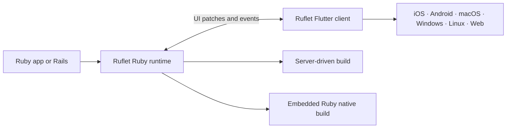

<p align="center">
  
</p>

<h1 align="center">Ruflet</h1>

<p align="center">
  <strong>Build web, desktop, and mobile applications in Ruby.</strong>
</p>

<p align="center">
  <a href="https://rubygems.org/gems/ruflet"></a>
  
  <a href="https://github.com/AdamMusa/ruflet/actions/workflows/build-ruflet-android.yml"></a>
  <a href="LICENSE"></a>
</p>

Ruflet is a Ruby-first cross-platform UI framework. Write controls, events,
state, navigation, and device integrations in Ruby while Flutter renders the
application on Android, iOS, macOS, Windows, Linux, and the web.

Develop against a live Ruby backend with fast reloads, or package Ruby and the
application into a self-contained native build. No Dart, Kotlin, Swift,
JavaScript, or platform-specific UI code is required in your application.

> [!NOTE]
> Ruflet is under active pre-1.0 development. APIs can evolve as the framework
> moves toward a stable release.

## Why Ruflet?

- **One Ruby UI for every screen.** Use the same controls, callbacks, and state
  model across mobile, desktop, and web.
- **Flutter-rendered interfaces.** Build Material and Cupertino experiences
  with responsive layouts, navigation, dialogs, data tables, charts, maps,
  media, animations, canvas drawing, and more.
- **A fast development loop.** Ruby files reload without restarting the client.
  Broken edits keep the last working interface visible while Ruflet reports the
  error in the terminal.
- **Server-driven or self-contained.** Keep application logic on a Ruby server,
  or embed the Ruby runtime and app into a native package with `--self`.
- **Real device capabilities.** Work with camera, location, motion, storage,
  sharing, haptics, sensors, and protected native permissions through Ruby APIs.
- **Targeted live updates.** Update mounted controls without rebuilding the
  entire page, while events travel back to ordinary Ruby callbacks.
- **Rails-aware.** Mount Ruflet inside Rails, work with the same models and
  application code, or place existing Rails pages inside a managed native
  WebView shell.
- **Extensible the Flet way.** Add typed Ruby controls backed by standard Flet
  Flutter extension packages. Ruflet's QR and barcode scanner is built with the
  same extension model.

## A Ruflet app

This counter is a complete Ruflet application:

```ruby
require "ruflet"

Ruflet.run do |page|
  page.title = "Ruflet Counter"

  count = 0
  counter = text(
    value: "0",
    style: { size: 48, weight: "w700" }
  )

  page.add(
    container(
      expand: true,
      padding: 24,
      alignment: "center",
      content: column(
        spacing: 16,
        horizontal_alignment: "center",
        children: [
          text(
            value: "Count every tap",
            style: { size: 22, weight: "w600" }
          ),
          counter,
          button(
            content: "Add one",
            on_click: ->(_event) do
              count += 1
              page.update(counter, value: count.to_s)
            end
          )
        ]
      )
    )
  )
end
```

Controls build the interface tree, callbacks run in Ruby, and `page.update`
patches the mounted control on every connected client.

## Quick start

Install Ruflet, create a project, and start it:

```bash
gem install ruflet
ruflet new my_app
cd my_app
bundle install
ruflet run
```

`ruflet run` starts the Ruby backend and prints a QR code for the mobile client.
Run Ruflet commands directly—there is no need to prefix them with `bundle exec`.

Open the same application in a browser or native desktop client:

```bash
ruflet run --web
ruflet run --desktop
```

### Development targets

| Target | Command | What happens |
| --- | --- | --- |
| Mobile | `ruflet run` | Starts the backend and prints a connection QR code. |
| Web | `ruflet run --web` | Starts the backend and opens the Ruflet web client. |
| Desktop | `ruflet run --desktop` | Starts the backend and launches the host desktop client. |

Hot reload is enabled by default. Press `r` for a manual Ruby UI reload or `R`
for a complete backend restart. The current route survives a reload; in-memory
application state starts fresh. Use `--no-reload` when file watching is not
wanted.

## Two ways to ship

| Mode | Best for | How it works |
| --- | --- | --- |
| **Server-driven** | Connected applications, shared business logic, Rails, and centrally deployed updates | The Flutter client connects to a Ruby backend and receives UI patches over its live connection. |
| **Self-contained** | Native distribution and local or offline Ruby execution | Ruflet packages the Ruby runtime, application files, and Flutter client together with `ruflet build <target> --self`. |

Both modes use the same Ruby controls and event handlers.

## Advanced by design

### Rich controls without frontend glue

Ruflet exposes Ruby builders for layout, navigation, inputs, dialogs, menus,
responsive views, drag and drop, canvas shapes, maps, charts, media, Lottie,
Rive, Markdown, SpinKit loaders, and adaptive Material/Cupertino controls.

Use the Ruby DSL directly:

```ruby
dashboard = column(
  spacing: 12,
  children: [
    text(value: "Dashboard", style: { size: 28, weight: "w700" }),
    responsive_row(
      children: [
        card(content: text(value: "Revenue"), col: { xs: 12, md: 6 }),
        card(content: text(value: "Orders"), col: { xs: 12, md: 6 })
      ]
    ),
    lottie("assets/success.json", repeat: true)
  ]
)
```

### Navigation, overlays, and application services

The `page` object owns application-level behavior: routes and views, dialogs,
bottom sheets, snackbars, menus, windows, clipboard, file picking, sharing,
URLs, storage paths, screenshots, camera access, haptics, and other services.

```ruby
page.go("/settings", tab: "profile")
page.open(alert_dialog(title: text(value: "Saved")))
page.launch_url("https://example.com")
```

### Extensions that stay typed in Ruby

Independent extensions are selected in `ruflet.yaml`, then Ruflet includes the
matching Flet Flutter packages and registrations in the generated client. Maps,
charts, code editing, Lottie, Rive, video, WebView, and QR scanning are examples
of extension-backed controls.

```yaml
extensions:
  - charts
  - lottie
  - map
  - qrcode_scanner
  - webview
```

The QR scanner is a first-party example: `ruflet_qrcode_scanner` is a normal
Flet extension package backed by `mobile_scanner`, while application code uses
the Ruby `qrcode_scanner(...)` builder.

### Protected capabilities are explicit

Camera, microphone, location, and motion access are declared in
`services.yaml`. Ruflet activates the required client integrations and writes
the matching Android and iOS permission descriptions during the build.

```yaml
services:
  - camera:
      description: Scan QR codes and capture photos.
  - location:
      description: Show nearby places.
```

## Project configuration

A generated application keeps runtime and build choices separate from native
identity and protected capabilities:

| File | Purpose |
| --- | --- |
| `main.rb` | Ruby application entry point. |
| `ruflet.yaml` | Backend URL, UI extensions, assets, and build presentation. |
| `services.yaml` | Application identity and protected native capabilities. |
| `Gemfile` | Ruby runtime dependencies. |

### Application identity

Mobile application identity comes from `services.yaml`:

```yaml
app:
  app_name: My Ruflet App
  package_name: my_ruflet_app
  organization: com.example
  version: 1.0.0+1
  description: A cross-platform Ruflet application.

services: []
```

For Android and iOS, Ruflet derives `com.example.my_ruflet_app` and applies it
through `change_app_package_name` during the build pipeline. A mobile build
stops with a configuration error when `app_name`, `package_name`, or
`organization` is missing; the Flutter template identifier is never shipped as
the application's identifier.

### Runtime and assets

```yaml
app:
  backend_url: https://api.example.com

extensions:
  - charts
  - map

assets:
  dir: assets
  splash_screen: assets/splash.png
  icon_launcher: assets/icon.png

build:
  splash_color: "#FFFFFF"
  splash_dark_color: "#0B0B0B"
  icon_background: "#FFFFFF"
  theme_color: "#FFFFFF"
```

`backend_url` is required for server-driven production builds. It is not
required when building with `--self`.

## Build and install

Check the local toolchain first. Ruflet can install and manage a compatible
Flutter SDK when needed:

```bash
ruflet doctor
ruflet doctor --fix
```

Build for a target platform:

```bash
ruflet build apk
ruflet build aab
ruflet build ios
ruflet build macos
ruflet build windows
ruflet build linux
ruflet build web
```

Add `--self` to package the Ruby runtime and application into a native build:

```bash
ruflet build apk --self
ruflet build ios --self
```

Install the latest mobile build on a connected device:

```bash
ruflet devices
ruflet install
ruflet install --device DEVICE_ID
```

Ruflet uses the canonical external Flutter template, resolves packages,
applies app identity, generates splash screens and launcher icons, prepares
native dependencies, and then runs the platform build.

## Ruby on Rails

Already building with Rails? [`ruflet_rails`](packages/ruflet_rails/README.md)
mounts Ruby-driven Ruflet applications inside Rails so callbacks can work with
the same models, jobs, policies, and application code.

Ruflet Rails also supports a managed native WebView shell for existing Rails
HTML. Rails views can opt into native AppBars, drawers, navigation bars,
dialogs, sheets, menus, and device services without turning the entire Rails
application into a new frontend stack.

```ruby
# Gemfile
gem "ruflet_rails"
```

```bash
bin/rails generate ruflet:install --web --desktop
```

See the [Ruflet Rails guide](packages/ruflet_rails/README.md) for mounting,
native builds, WebView navigation, Turbo behavior, and ERB helpers.

## How it works



Ruby creates a typed control tree. Ruflet serializes that tree and later
updates into Flet-compatible messages. The Flutter client renders the controls
and sends user events back to Ruby. The same model works with a standalone
Ruflet server, a Rails host, or the embedded Ruby runtime.

## CLI reference

<details>
<summary>Show all Ruflet commands</summary>

```text
ruflet --version
ruflet new <appname>
ruflet run [scriptname|path] [--web|--desktop] [--port PORT] [--no-reload]
ruflet debug [scriptname|path]
ruflet doctor [--fix] [--verbose]
ruflet devices
ruflet emulators
ruflet update [web|desktop|all] [--check] [--force] [--platform PLATFORM]
ruflet build <apk|android|ios|aab|web|macos|windows|linux> [--self] [--verbose]
ruflet install [--device DEVICE_ID] [--verbose]
```

</details>

## Repository packages

<details>
<summary>Show the Ruflet monorepo structure</summary>

- [`ruflet`](packages/ruflet/README.md) — project generation and command-line
  workflows.
- [`ruflet_core`](packages/ruflet_core/README.md) — controls, builders, events,
  services, page APIs, and application lifecycle.
- [`ruflet_server`](packages/ruflet_server/README.md) — server-driven runtime
  and live client connections.
- [`ruflet_rails`](packages/ruflet_rails/README.md) — Rails mounting,
  generators, native builds, and WebView integration.
- `ruby_runtime` — embedded Ruby runtime for self-contained native builds.
- `ruflet_client` — reusable Flutter client and bundled Flet extension
  packages.

</details>

## Learn and contribute

- Read the [core Ruby API overview](packages/ruflet_core/README.md).
- Explore the [CLI guide](packages/ruflet/README.md).
- Build with the [Rails integration](packages/ruflet_rails/README.md).
- See the [contribution guide](CONTRIBUTING_RUFLET.md) for architecture,
  testing, and extension work.
- Report bugs or propose features through
  [GitHub Issues](https://github.com/AdamMusa/ruflet/issues).

Contributions are welcome. Please keep public examples on the Ruby DSL, add
focused coverage for behavior changes, and verify Ruby/client protocol changes
across the affected targets.

## License

Ruflet is available under the [MIT License](LICENSE).
